# MEV Bot Architecture Diagrams

Complete architecture documentation for all four educational MEV bots.

---

## 1. Sandwich Attack Bot

### High-Level Architecture

### Detailed Data Flow

### Component Details

---

## 2. Aave Flashloan Arbitrage Bot

### High-Level Architecture

### Flashloan Execution Flow

### Price Scanning Process

---

## 3. Aave Front-Running Bot (Detection Only)

### High-Level Architecture

### Detection & Analysis Flow

```mermaid
sequenceDiagram
    participant M as Mempool
    participant Mon as Monitor
    participant Ana as Analyzer
    participant Out as Educational Output

    M->>Mon: Pending Aave transaction
    Mon->>Mon: Parse transaction:<br/>- supply()<br/>- borrow()<br/>- liquidationCall()

    alt Deposit Operation
        Mon->>Ana: Deposit TX details
        Ana->>Ana: Calculate potential:<br/>- Interest rate manipulation<br/>- Utilization impact<br/>- Expected "profit"
        Ana->>Out: ⚠️ Deposit Front-Run Opportunity
        Out->>Out: Log: How it works
        Out->>Out: Log: Why it's harmful
        Out->>Out: Log: Protection methods
    end

    alt Borrow Operation
        Mon->>Ana: Borrow TX details
        Ana->>Ana: Calculate potential:<br/>- Liquidity drain<br/>- Rate increase<br/>- User impact
        Ana->>Out: ⚠️ Borrow Front-Run Opportunity
        Out->>Out: Educational analysis
    end

    alt Liquidation
        Mon->>Ana: Liquidation TX details
        Ana->>Ana: Calculate:<br/>- 5-10% liquidation bonus<br/>- Gas costs<br/>- Net profit potential
        Ana->>Out: ⚠️ Liquidation Front-Run Opportunity
        Out->>Out: Explain attack + protections
    end

    Note over Out: ❌ NO EXECUTION<br/>Detection only!
```

### Attack Vector Analysis

---

## 4. Aave Back-Running Bot

### High-Level Architecture

```mermaid
graph TB
    subgraph "Back-Running Bot"
        EM[Event Monitor<br/>Real-Time Events]
        OD[Opportunity Detector<br/>State Change Analysis]
        SA[Strategy Analyzer<br/>Educational Output]
    end

    subgraph "Aave Protocol Events"
        BORROW[Borrow Event<br/>Utilization ↑]
        REPAY[Repay Event<br/>Utilization ↓]
        LIQ[Liquidation Event<br/>Price Impact]
        SUPPLY[Supply Event<br/>Liquidity ↑]
    end

    subgraph "Opportunity Types"
        ARB[Arbitrage<br/>Price Normalization]
        RATE[Rate Arbitrage<br/>Cross-Protocol]
        CASCADE[Liquidation Cascade<br/>Market Efficiency]
    end

    BORROW -->|Emitted| EM
    REPAY -->|Emitted| EM
    LIQ -->|Emitted| EM
    SUPPLY -->|Emitted| EM

    EM -->|Event Data| OD

    OD -->|After Large Borrow| ARB
    OD -->|After Repay| RATE
    OD -->|After Liquidation| CASCADE

    ARB --> SA
    RATE --> SA
    CASCADE --> SA

    style EM fill:#e1f5ff
    style OD fill:#fff4e1
    style SA fill:#e1ffe1
```

### Event-Driven Execution Flow

```mermaid
sequenceDiagram
    participant Aave as Aave Pool
    participant Mon as Event Monitor
    participant Det as Detector
    participant Out as Output

    Note over Aave: User borrows 100 ETH
    Aave->>Mon: Borrow event emitted

    Mon->>Det: Event: Borrow<br/>asset: ETH<br/>amount: 100<br/>user: 0x123...

    Det->>Det: Analyze impact:<br/>- Utilization increased<br/>- Interest rates adjusted up<br/>- Price impact on DEXs

    alt Arbitrage Opportunity
        Det->>Det: Calculate:<br/>- Price difference created<br/>- Expected profit<br/>- Gas costs

        Det->>Out: 💰 Back-run Strategy: ARBITRAGE
        Out->>Out: Explain: Price imbalance<br/>from large borrow
        Out->>Out: Steps to execute:<br/>1. Detect rate change<br/>2. Arbitrage delta<br/>3. Profit from correction
    end

    Note over Aave: User liquidated
    Aave->>Mon: LiquidationCall event

    Mon->>Det: Liquidation details
    Det->>Det: Analyze cascade risk:<br/>- Collateral dumped<br/>- Price impact<br/>- Additional liquidations?

    alt Cascade Opportunity
        Det->>Out: ⚡ Back-run Strategy: CASCADE
        Out->>Out: Explain market efficiency<br/>role of back-running
    end

    Note over Out: ✅ EDUCATIONAL ONLY<br/>Shows opportunities,<br/>doesn't execute
```

### Strategy Decision Tree

```mermaid
graph TD
    EVENT[Aave Event Detected]

    EVENT --> TYPE{Event Type?}

    TYPE -->|Borrow| BORROW_ANALYZE[Analyze Borrow]
    TYPE -->|Repay| REPAY_ANALYZE[Analyze Repay]
    TYPE -->|Liquidation| LIQ_ANALYZE[Analyze Liquidation]
    TYPE -->|Supply| SUPPLY_ANALYZE[Analyze Supply]

    BORROW_ANALYZE --> UTIL_UP{Utilization<br/>Increased?}
    UTIL_UP -->|Yes| RATE_UP[Interest Rates ↑]
    RATE_UP --> RATE_ARB[Rate Arbitrage<br/>Opportunity]

    REPAY_ANALYZE --> UTIL_DOWN{Utilization<br/>Decreased?}
    UTIL_DOWN -->|Yes| RATE_DOWN[Interest Rates ↓]
    RATE_DOWN --> BORROW_CHEAP[Borrow at Lower Rate<br/>Opportunity]

    LIQ_ANALYZE --> PRICE_IMPACT{Significant<br/>Price Impact?}
    PRICE_IMPACT -->|Yes| ARB_OPP[Arbitrage<br/>Opportunity]
    PRICE_IMPACT -->|Yes| CASCADE_CHECK[Check Cascade Risk]

    SUPPLY_ANALYZE --> LIQ_UP{Liquidity<br/>Increased?}
    LIQ_UP -->|Yes| SPREAD[Spread<br/>Tightening]

    RATE_ARB --> OUTPUT[Educational Output]
    BORROW_CHEAP --> OUTPUT
    ARB_OPP --> OUTPUT
    CASCADE_CHECK --> OUTPUT
    SPREAD --> OUTPUT

    style OUTPUT fill:#90EE90
    style RATE_ARB fill:#FFE4B5
    style ARB_OPP fill:#FFE4B5
    style CASCADE_CHECK fill:#FFB6C1
```

---

## System Comparison

### Architecture Comparison Matrix

### Component Reusability

---

## Performance Characteristics

### Latency Comparison

| Bot | Detection | Calculation | Execution | Total | Target Network |
|-----|-----------|-------------|-----------|-------|----------------|
| **Sandwich** | 50-100ms | 10-50ms | 50-200ms | 110-350ms | L2 (100ms acceptable) |
| **Flashloan Arb** | N/A (scan) | 50-200ms | 200-500ms | 250-700ms | Any (not latency sensitive) |
| **Front-Run** | 50-100ms | 10-20ms | N/A (no exec) | 60-120ms | Detection only |
| **Back-Run** | <10ms (events) | 20-50ms | 100-300ms | 120-350ms | L1/L2 (post-event) |

### Resource Requirements

---

## Deployment Architecture

### Development Setup

### Testnet Deployment

### Production Architecture (Educational Reference)

---

## Security Architecture

### Access Control

---

## Educational Value

Each bot teaches different concepts:

| Bot | Primary Learning | Secondary Learning | Advanced Topics |
|-----|-----------------|-------------------|-----------------|
| **Sandwich** | MEV extraction | Gas price auctions | Mempool analysis |
| **Flashloan** | DeFi composability | Aave V3 integration | Cross-DEX arbitrage |
| **Front-Run** | Attack vectors | Detection methods | Ethical considerations |
| **Back-Run** | Event-driven strategies | Market efficiency | Cascade effects |

---

**Note**: All architectures shown are for **EDUCATIONAL PURPOSES ONLY**. Do not use for production deployment or to harm real users.

For implementation details, see individual bot README files and [BOTS.md](BOTS.md).
