# Flash Loan Arbitrage & MEV Bot Architecture Diagrams

This document provides visual architecture diagrams for the various flash loan and MEV bot implementations documented in this repository.

---

## Table of Contents

1. [Overall System Architecture](#overall-system-architecture)
2. [Sandwich Bot Architecture (All Implementations)](#sandwich-bot-architecture)
3. [TypeScript Implementation Flow](#typescript-implementation-flow)
4. [Rust Implementation Flow](#rust-implementation-flow)
5. [Smart Contract Execution Flow](#smart-contract-execution-flow)
6. [MEV Protection Strategies](#mev-protection-strategies)

---

## Overall System Architecture

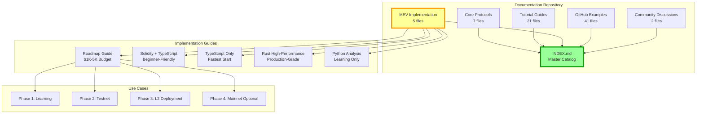

---

## Sandwich Bot Architecture

### High-Level Component Diagram

```mermaid
graph LR
    subgraph "Monitoring Layer"
        A[WebSocket RPC] --> B[Mempool Monitor]
        B --> C{Filter Transactions}
    end

    subgraph "Analysis Layer"
        C --> D[Parse Swap Transaction]
        D --> E[Whitelist Check]
        E --> F[Salmonella Detector]
        F --> G[Profit Calculator]
    end

    subgraph "Execution Layer"
        G --> H{Profitable?}
        H -->|Yes| I[Build Sandwich TX]
        H -->|No| J[Skip]
        I --> K[Submit to Blockchain]
    end

    subgraph "Smart Contract"
        K --> L[Flash Swap Borrow]
        L --> M[Front-run Buy]
        M --> N[Victim TX Executes]
        N --> O[Back-run Sell]
        O --> P[Repay Flash Swap + Fee]
        P --> Q{Profitable?}
        Q -->|Yes| R[Keep Profit]
        Q -->|No| S[Revert Transaction]
    end

    style F fill:#f99,stroke:#f00,stroke-width:2px
    style G fill:#9f9,stroke:#090,stroke-width:2px
    style R fill:#9ff,stroke:#09f,stroke-width:2px
```

### Data Flow Diagram

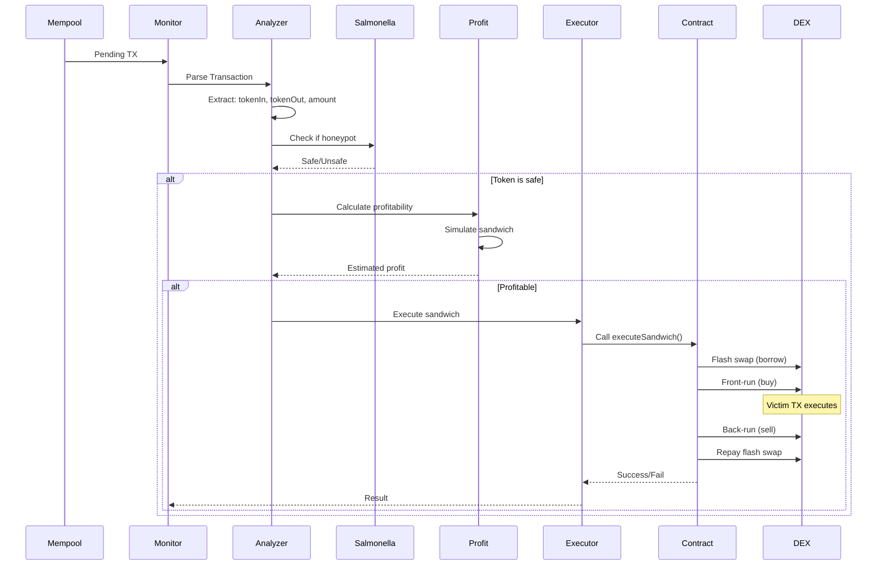

---

## TypeScript Implementation Flow

### Component Architecture

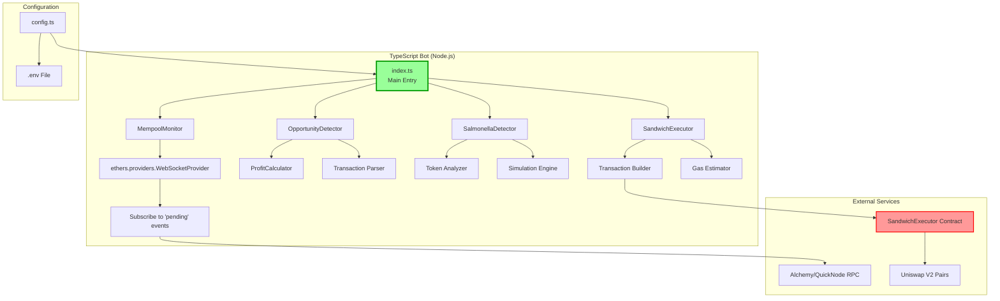

### Execution Timeline

```mermaid
gantt
    title TypeScript Bot Execution Timeline
    dateFormat X
    axisFormat %L ms

    section Detection
    WebSocket Event           :0, 5
    Fetch TX Details          :5, 15
    Parse Transaction         :15, 20

    section Analysis
    Whitelist Check           :20, 21
    Salmonella Detection      :21, 26
    Profit Calculation        :26, 35

    section Execution
    Build TX                  :35, 40
    Submit to Network         :40, 50
    Wait for Confirmation     :50, 100

    section Total Latency
    End-to-End               :crit, 0, 100
```

**Expected Latency: 50-100ms** (Competitive for L2)

---

## Rust Implementation Flow

### High-Performance Architecture

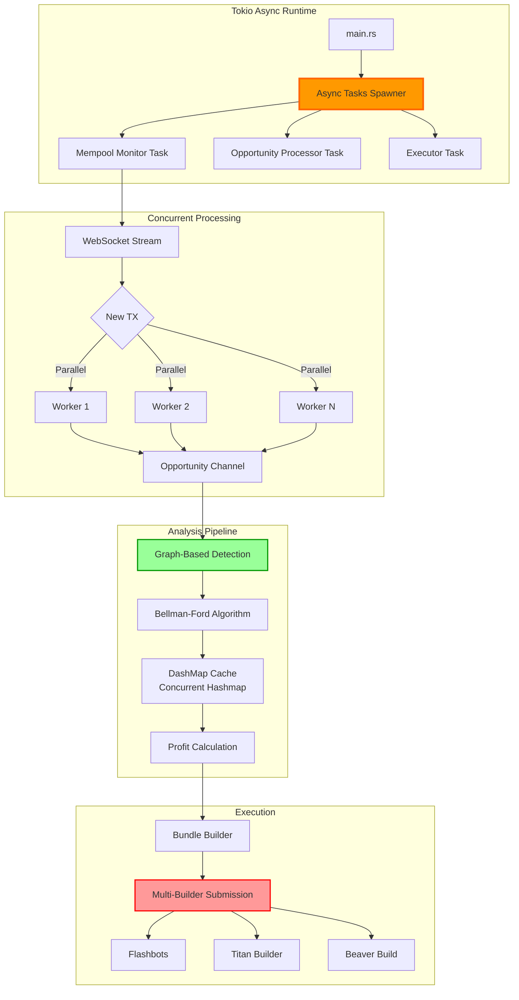

### Parallel Processing Flow

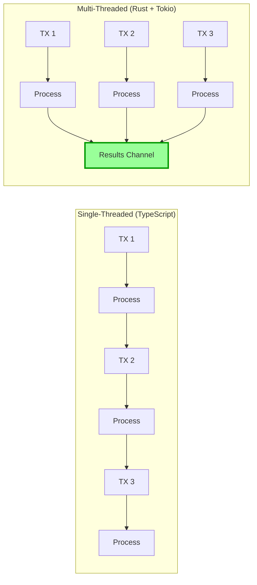

**Expected Latency: 10-20ms** (Competitive for Mainnet)

---

## Smart Contract Execution Flow

### Flash Swap Sandwich Pattern

```mermaid
sequenceDiagram
    participant Bot
    participant SandwichExecutor
    participant UniswapPair
    participant Victim
    participant Market

    Bot->>SandwichExecutor: executeSandwich(tokenIn, tokenOut, amount)
    activate SandwichExecutor

    SandwichExecutor->>UniswapPair: swap(amount0Out, amount1Out, callback_data)
    Note over UniswapPair: Flash swap initiated

    UniswapPair->>SandwichExecutor: Send tokens (flash loan)
    UniswapPair->>SandwichExecutor: uniswapV2Call() callback

    rect rgb(255, 200, 200)
        Note over SandwichExecutor: Front-run execution
        SandwichExecutor->>Market: Buy tokenOut with tokenIn
        Market-->>SandwichExecutor: Receive tokenOut
        Note over Market: Price increases ↑
    end

    rect rgb(200, 200, 255)
        Note over Victim,Market: Victim transaction executes
        Victim->>Market: Swap
        Note over Market: Price increases more ↑↑
    end

    rect rgb(200, 255, 200)
        Note over SandwichExecutor: Back-run execution
        SandwichExecutor->>Market: Sell tokenOut for tokenIn
        Market-->>SandwichExecutor: Receive tokenIn (+ profit)
    end

    SandwichExecutor->>UniswapPair: Repay flash swap + 0.3% fee
    deactivate SandwichExecutor

    alt Profitable
        SandwichExecutor-->>Bot: Success (profit retained)
    else Not Profitable
        SandwichExecutor-->>Bot: Revert (no loss except gas)
    end
```

### Gas Optimization Techniques

```mermaid
graph TD
    subgraph "Standard Solidity (~150K gas)"
        A1[Storage Variables]
        A2[Multiple SLOAD Operations]
        A3[Standard Transfers]
        A4[Function Calls]
    end

    subgraph "Optimized Solidity (~120K gas)"
        B1[Memory Variables]
        B2[Immutable Constants]
        B3[Cached Values]
        B4[Inline Operations]
    end

    subgraph "Huff/Yul Assembly (~80K gas)"
        C1[Raw Assembly]
        C2[Direct Stack Manipulation]
        C3[Optimized Loops]
        C4[Minimal ABI Encoding]
    end

    A1 & A2 & A3 & A4 --> D[150K Gas]
    B1 & B2 & B3 & B4 --> E[120K Gas<br/>20% Savings]
    C1 & C2 & C3 & C4 --> F[80K Gas<br/>47% Savings]

    style F fill:#9f9,stroke:#090,stroke-width:3px
    style E fill:#ff9,stroke:#f90,stroke-width:2px
    style D fill:#f99,stroke:#f00,stroke-width:2px
```

---

## MEV Protection Strategies

### User Protection Mechanisms

```mermaid
graph TD
    subgraph "Vulnerable User"
        A[Public Mempool] --> B[Visible to All Bots]
        B --> C[High Slippage 5%+]
        C --> D[Gets Sandwiched]
        D --> E[Loses 0.5-2% of Trade]
    end

    subgraph "Protected User (Flashbots)"
        F[Private Mempool] --> G[Flashbots Protect RPC]
        G --> H[Bundle Submission]
        H --> I[Direct to Builder]
        I --> J[No Front-Running Possible]
    end

    subgraph "Protected User (CoW Swap)"
        K[CoW Swap Order] --> L[Off-Chain Matching]
        L --> M[Batch Settlement]
        M --> N[MEV Protection]
        N --> O[No Sandwich Possible]
    end

    subgraph "Protected User (Low Slippage)"
        P[0.5% Slippage Setting] --> Q[Transaction Reverts if Sandwiched]
        Q --> R[No Value Extracted]
    end

    style J fill:#9f9,stroke:#090,stroke-width:3px
    style O fill:#9f9,stroke:#090,stroke-width:3px
    style R fill:#9f9,stroke:#090,stroke-width:3px
    style E fill:#f99,stroke:#f00,stroke-width:3px
```

### Bot Defense Layers

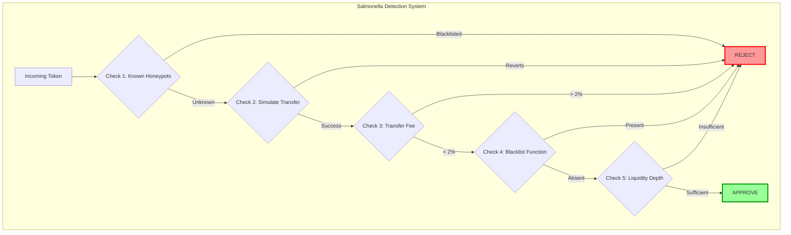

### Decision Tree: To Sandwich or Not

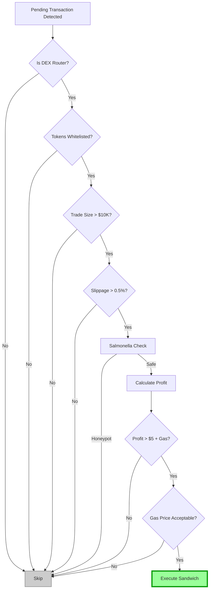

---

## Deployment Architecture

### L2 vs Mainnet Comparison

```mermaid
graph TD
    subgraph "Ethereum Mainnet (Expensive)"
        A1[RPC Node<br/>$500-2K/month] --> A2[Bot Instance]
        A2 --> A3[Gas Cost<br/>$10-50/sandwich]
        A3 --> A4[Minimum Profit<br/>$30+ required]
        A4 --> A5[Break-even<br/>3-5 sandwiches/day]
        A5 --> A6[Capital Needed<br/>$50K+]
    end

    subgraph "Arbitrum L2 (Affordable)"
        B1[RPC Node<br/>$49-99/month] --> B2[Bot Instance]
        B2 --> B3[Gas Cost<br/>$0.10-1/sandwich]
        B3 --> B4[Minimum Profit<br/>$1+ required]
        B4 --> B5[Break-even<br/>10-20 sandwiches/month]
        B5 --> B6[Capital Needed<br/>$1K-5K]
    end

    style B6 fill:#9f9,stroke:#090,stroke-width:3px
    style A6 fill:#f99,stroke:#f00,stroke-width:2px
```

### Infrastructure Setup

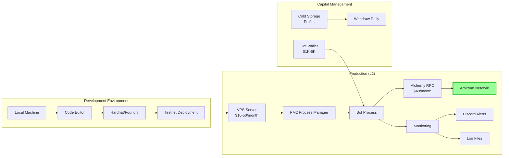

---

## Performance Metrics Dashboard

### Key Performance Indicators

```mermaid
graph TD
    subgraph "Detection Metrics"
        A1[Latency: <50ms] --> A[🎯 Target]
        A2[Latency: 50-100ms] --> B[✅ Acceptable L2]
        A3[Latency: >100ms] --> C[❌ Too Slow]
    end

    subgraph "Success Metrics"
        B1[Success Rate: >20%] --> D[🎯 Excellent]
        B2[Success Rate: 10-20%] --> E[✅ Good]
        B3[Success Rate: <10%] --> F[⚠️ Needs Optimization]
    end

    subgraph "Profitability Metrics"
        C1[Net Profit: >$500/month] --> G[🎯 Profitable]
        C2[Net Profit: $0-500/month] --> H[✅ Break-even]
        C3[Net Profit: <$0/month] --> I[❌ Losing Money]
    end

    style D fill:#9f9,stroke:#090,stroke-width:3px
    style G fill:#9f9,stroke:#090,stroke-width:3px
    style I fill:#f99,stroke:#f00,stroke-width:3px
```

---

## Conclusion

These diagrams illustrate:
- ✅ Complete system architecture for all implementations
- ✅ Data flow from mempool monitoring to execution
- ✅ Performance comparisons between languages
- ✅ MEV protection strategies
- ✅ Deployment architecture for L2 vs mainnet

**Use these diagrams to:**
- Understand overall system design
- Choose the right implementation for your needs
- Visualize the sandwich attack flow
- Plan your infrastructure
- Set realistic performance targets

For implementation details, see the respective guide files in `context/tutorials/`.
